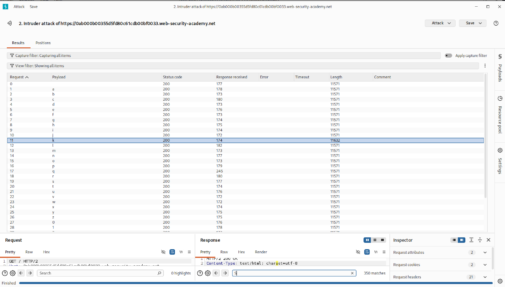
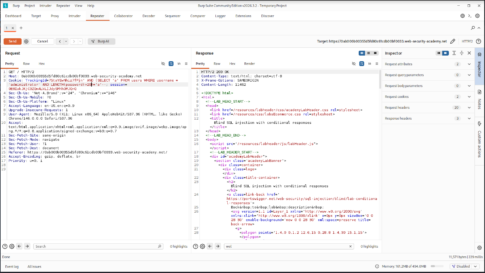

# Blind SQL Injection with Conditional Responses

> **PortSwigger Web Security Lab Writeup**

---

## Lab Environment

| Component     | Details                        |
|---------------|--------------------------------|
| OS            | Kali Linux                     |
| Browser       | Firefox                        |
| Proxy Tool    | Burp Suite Community Edition   |
| Target        | PortSwigger Lab Environment    |
| Language      | Python                         |
| Category      | SQL Injection                  |
| Difficulty    | Practitioner                   |

---

## Objective

Exploit a blind SQL injection vulnerability in the `TrackingId` cookie parameter to extract the administrator's password from the `users` table — without any visible query output.

---

## Vulnerability Overview

The application uses a `TrackingId` cookie to track returning users. When the tracking ID matches a record in the database, the page responds with the text **"Welcome back!"**

This conditional response is the only signal available — no data is ever directly returned. However, because the cookie value is passed unsanitized into the SQL query, an attacker can inject boolean conditions and infer information from whether or not "Welcome back!" appears in the response.

**Root Cause:** The `TrackingId` parameter is concatenated directly into a SQL query with no parameterization or input sanitization, allowing arbitrary SQL to be injected and evaluated server-side.

---

## Attack Procedure

### Step 1 — Confirm SQL Injection

Begin by injecting a single quote to break the SQL syntax and observe whether the application response changes. A server-side error or altered response confirms that the input is being interpreted as SQL.

```
TrackingId = xyz'
```

---

### Step 2 — Verify the `users` Table Exists

Inject a subquery that returns a value only if the `users` table exists with at least one row. If **"Welcome back!"** is returned, the table exists.

```sql
TrackingId = xyz' AND (SELECT 'a' FROM users LIMIT 1) = 'a'--
```

✅ **Expected Result:** "Welcome back!" is present → `users` table exists.

---

### Step 3 — Confirm the `administrator` Account Exists

Narrow the query to check whether a row exists with `username = 'administrator'`.

```sql
TrackingId = xyz' AND (SELECT 'a' FROM users WHERE username = 'administrator') = 'a'--
```

✅ **Expected Result:** "Welcome back!" is present → `administrator` account exists.

---

### Step 4 — Determine the Password Length

Iterate the `LENGTH(password)` condition, incrementing `n` from 1 until the conditional response disappears. The last value of `n` that returns "Welcome back!" is the password length.

```sql
TrackingId = xyz' AND (SELECT 'a' FROM users WHERE username = 'administrator' AND LENGTH(password) > n) = 'a'--
```

> Increment `n` from `1` upward. The response stops returning "Welcome back!" once `n` exceeds the actual password length.

✅ **Result:** Password length = **20 characters**

---

### Step 5 — Extract the Password Character by Character

For each position (1–20), iterate through all possible alphanumeric characters (`a-z`, `0-9`) using the `SUBSTRING()` function. When a character matches, "Welcome back!" is returned.

```sql
TrackingId = xyz' AND (SELECT 'a' FROM users WHERE username = 'administrator' AND SUBSTRING(password, {pos}, 1) = '{char}') = 'a'--
```

Where:
- `{pos}` = character position (1 to 20)
- `{char}` = candidate character being tested

This is automated using Burp Suite Intruder (Cluster Bomb attack) or the Python script below.

---

## Automation Script

[`blind_sqli.py`](./scripts/script.py)**

The script automates Steps 4 and 5 — determining the password length and then brute-forcing each character position using boolean-based inference.

---

## Screenshots

### Burp Suite Intruder — Cluster Bomb Attack


---

### Cookie Parameter in Burp Suite HTTP Request


---

## Conclusion

This lab demonstrated how a blind SQL injection vulnerability in a cookie parameter can be chained into a full credential extraction attack — purely through conditional application responses, with no data ever directly reflected.

**Attack chain summary:**

1. Single quote confirms SQL injection
2. Boolean subqueries verify table and account existence
3. `LENGTH()` function determines password length via binary-style probing
4. `SUBSTRING()` function extracts each character through exhaustive enumeration

**Root cause:** The `TrackingId` cookie value was concatenated directly into a SQL query without parameterization. A simple prepared statement or parameterized query would have fully prevented this attack.

**Remediation:**
- Use **parameterized queries / prepared statements** for all database interactions
- Apply **input validation and allowlisting** on cookie values
- Implement **WAF rules** to detect and block SQL injection patterns
- Follow the **principle of least privilege** — the database account should not have read access to the `users` table from the tracking query context

---

*Writeup conducted in a controlled PortSwigger lab environment for educational purposes.*