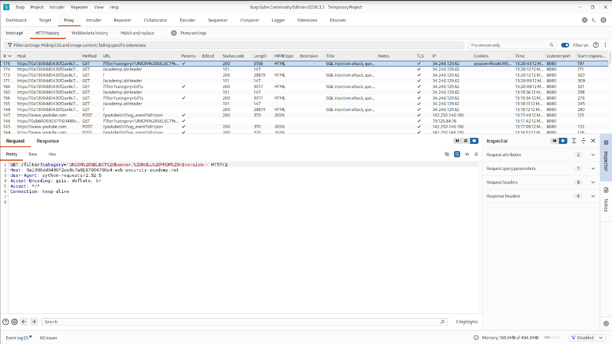
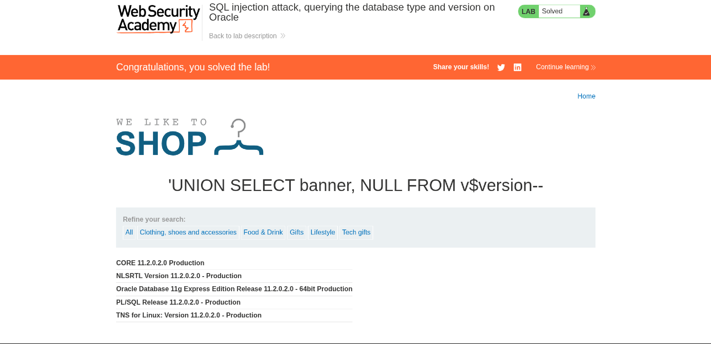

# SQL Injection — Querying Database Type and Version on Oracle

| Field         | Details                          |
|---------------|----------------------------------|
| **Platform**  | PortSwigger Web Security Academy |
| **Category**  | SQL Injection                    |
| **Difficulty**| Practitioner                     |
| **Database**  | Oracle                           |
| **Tools Used**| Kali Linux, Firefox, Burp Suite Community Edition |
| **Scripting** | Python                           |

---

## Objective

Query the database version of an Oracle database server by exploiting a SQL injection vulnerability exposed through the application's URL parameters.

---

## Vulnerability Overview

This lab demonstrates a basic but critical SQL injection vulnerability — one that allows an attacker to directly interact with the backend database through unsanitized URL input. When user-supplied input is embedded into SQL queries without proper validation or parameterization, an attacker can manipulate the query structure and extract sensitive information, such as the database type and version.

This type of vulnerability still appears in modern systems when developers skip input validation or fail to use parameterized queries.

---

## Procedure

### Step 1 — Check for SQL Injection

The first step is to probe the endpoint for SQL injection by appending a single quote to the URL:

```
url + '
```

If the application throws an error or returns an abnormal response, the input is being passed directly into a SQL query — a strong indicator of injection potential.

To confirm the vulnerability:

```sql
' OR 1=1--    -- always true → results returned
' OR 1=2--    -- always false → no results returned
```

A difference in response between the two payloads confirms that the application is vulnerable to SQL injection.

---

### Step 2 — Determine the Number of Columns

Before crafting a `UNION`-based payload, the number of columns returned by the original query must be determined. This is done using the `ORDER BY` technique:

```sql
' ORDER BY 1--
' ORDER BY 2--
' ORDER BY 3--   ← error here → 2 columns confirmed
```

When `ORDER BY 3` throws an error and `ORDER BY 2` does not, it confirms the query returns **2 columns**.

---

### Step 3 — Extract the Database Version

Oracle stores version information in the `v$version` view. With 2 columns confirmed, the following `UNION SELECT` payload is used to extract the banner:

```sql
' UNION SELECT banner, NULL FROM v$version--
```

This appends a second result set to the original query, injecting the Oracle version string directly into the application's response.

---

## Script

> Python automation script for this lab:
[exploit.py](Script/exploits.py)

---

## Screenshots / Burp Suite Images

> Burp Suite intercept and response screenshots:



> Version Output:


---

## Conclusion

This lab covered a textbook SQL injection scenario against an Oracle database. Starting from a simple quote-based probe, the attack was escalated step by step — confirming injection, identifying the column count, and finally extracting the database version using a `UNION SELECT` payload.

The core takeaway: this vulnerability exists because user input was directly embedded into SQL queries without sanitization or parameterization. It's a well-known, fully preventable flaw — yet it still appears in real-world systems today.

The exploitation process was also automated using a Python script to understand how such attacks can be scaled and scripted in practice.

---

> **Disclaimer:** This was performed in a controlled lab environment for educational purposes only. Do not attempt this against systems you do not own or have explicit permission to test.